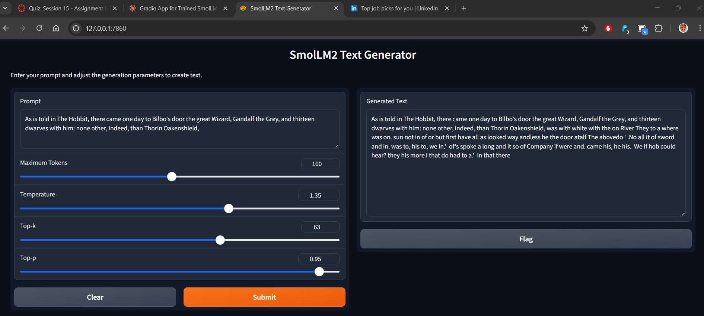
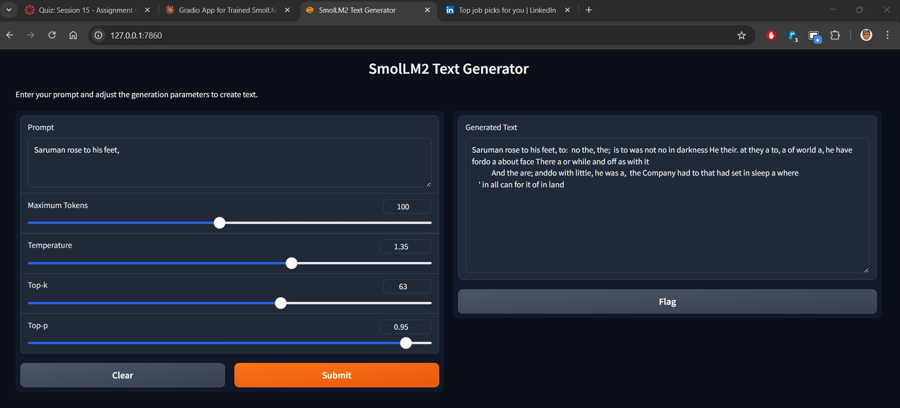
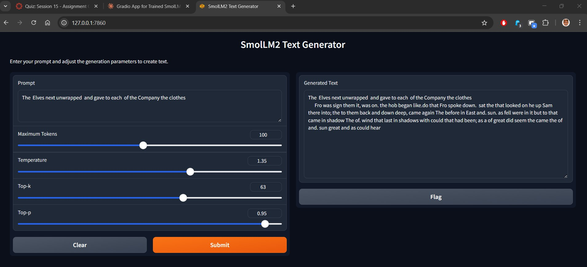
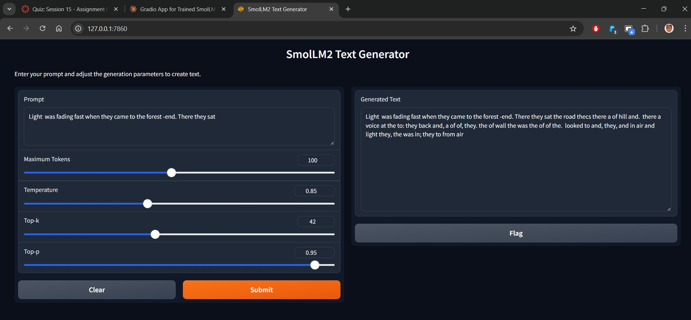
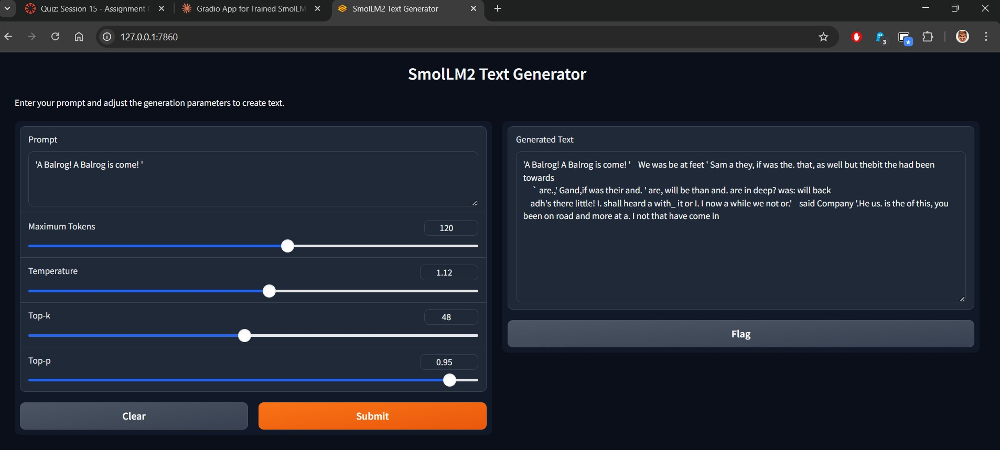
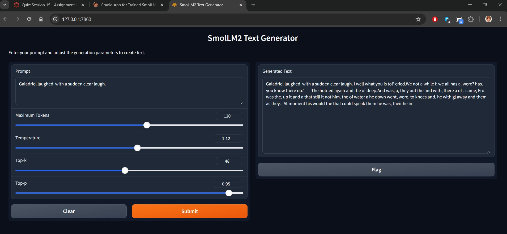

# Smollm2-DeepSeek Architecture

[](https://badge.fury.io/py/smollm2-deepseek)
[](https://www.python.org/downloads/)
[](https://opensource.org/licenses/MIT)
[](https://smollm2-deepseek.readthedocs.io/en/latest/?badge=latest)
[](https://github.com/psf/black)

This repository contains the implementation of Smollm2 architecture converted into DeepSeek architecture, incorporating Multi-head Linear Attention (MLHA) and Mixture of Experts (MoE).

## Architecture Overview

The model combines the efficient design principles of Smollm2 with DeepSeek's architectural innovations, particularly focusing on:

- **Multi-head Linear Attention (MLHA)**
  - Reduced computational complexity from O(n²) to O(n)
  - Improved memory efficiency while maintaining attention capabilities
  - Linear scaling with sequence length

- **Mixture of Experts (MoE)**
  - Dynamic routing of inputs to specialized expert networks
  - Increased model capacity without proportional computation costs
  - Enhanced representation learning through specialized expert pathways

- **Loss-less Load Balancing**
  - Optimal distribution of computational load across experts
  - Minimized expert capacity loss through advanced routing strategies
  - Improved training stability and resource utilization

## Key Features

1. **Efficient Attention Mechanism**
   - Linear attention implementation
   - Reduced memory footprint
   - Scalable to longer sequences

2. **Expert System**
   - Dynamic expert routing
   - Balanced expert utilization
   - Adaptive computation paths

## Model Architecture Details

```
Input
  │
  ├─ Embedding Layer
  │
  ├─ Transformer Blocks
  │   ├─ MLHA Layer
  │   │   ├─ Linear Projections
  │   │   └─ Efficient Attention Computation
  │   │
  │   ├─ MoE Layer
  │   │   ├─ Router Network
  │   │   ├─ Expert Networks
  │   │   
  │   │
  │   └─ Feed Forward Network
  │
  └─ Output Layer
```
## Model Output
<div align="center">
  
</div>
<div align="center">
  
</div>
<div align="center">
  
</div>
<div align="center">
  
</div>
<div align="center">
  
</div>
<div align="center">
  
</div>


## Implementation Notes

- The architecture maintains compatibility with standard transformer training approaches
- Implements custom attention patterns for improved efficiency
- Features specialized routing algorithms for MoE implementation
- Includes monitoring tools for expert utilization and load distribution


## References

1. Llama2 Architecture
2. DeepSeek V3 Technical Documentation
3. "Linear Attention Mechanisms: Theory and Implementation"
4. "Mixture of Experts with Load Balancing"
